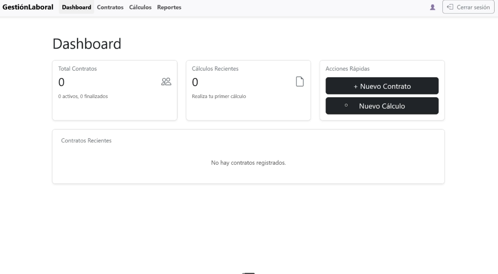

# Gestión Laboral

Aplicación web para la gestión de contratos, cálculos y reportes laborales. Permite a los usuarios autenticarse, gestionar contratos, realizar cálculos y visualizar reportes de manera sencilla y eficiente.

## 🎥 Demo en video

El video demostrativo se encuentra en la carpeta `screenshots/demo.mp4` del proyecto.

[](./screenshots/demo.mp4)
_Haz clic en la imagen para abrir el video_

## 🌟 Características destacadas

- **Sistema de roles integrado**: Diferentes permisos para empleados, empleadores, contadores, asesores legales y entidades gubernamentales
- **Interfaz intuitiva**: Diseño moderno y responsivo para facilitar la gestión laboral
- **Cálculos automáticos**: Generación automática de aportes según la normativa colombiana
- **Reportes detallados**: Exportación a PDF de todos los informes y cálculos
- **Seguridad robusta**: Autenticación JWT y protección de rutas según rol de usuario

## Tecnologías utilizadas

### Frontend

- **React** (Vite) - Framework para construir interfaces de usuario
- **React Router DOM** - Enrutamiento dinámico del lado del cliente
- **React Bootstrap** - Implementación de Bootstrap para React
- **React Icons** - Iconos vectoriales para mejorar la UI
- **jsPDF** - Generación de documentos PDF desde el navegador

### Backend

- **Django** - Framework web de alto nivel para desarrollo rápido
- **Django REST Framework** - Potente y flexible toolkit para construir APIs Web
- **JWT Authentication** (djangorestframework-simplejwt) - Autenticación segura basada en tokens
- **PostgreSQL** - Sistema de gestión de bases de datos relacional
- **Django Environ** - Manejo de variables de entorno
- **Django CORS Headers** - Manejo de solicitudes CORS

## Funcionalidades principales

- **Autenticación de usuarios** (login/logout)
- **Gestión de contratos**: crear, listar y administrar contratos laborales
- **Cálculos**: realizar cálculos relacionados a los contratos
- **Reportes**: visualizar reportes de la información gestionada
- **Interfaz responsiva** y moderna usando Bootstrap

## Estructura del proyecto

```plaintext
client/               # Carpeta del frontend (React)
  ├── public/         # Archivos públicos
  ├── src/            # Código fuente de la aplicación
  │   ├── components/ # Componentes reutilizables
  │   ├── pages/      # Páginas de la aplicación
  │   ├── App.jsx     # Componente principal
  │   └── index.js    # Punto de entrada
  ├── .env            # Variables de entorno
  ├── package.json     # Dependencias y scripts
  └── vite.config.js  # Configuración de Vite

server/               # Carpeta del backend (Django)
  ├── manage.py       # Script de gestión de Django
  ├── requirements.txt # Dependencias de Python
  ├── .env            # Variables de entorno
  └── app/            # Código fuente de la API
      ├── __init__.py
      ├── settings.py  # Configuración del proyecto Django
      ├── urls.py      # Rutas de la API
      └── wsgi.py      # Punto de entrada para servidores WSGI
```

## Instalación y ejecución

### Frontend (React)

1. **Clonar el repositorio**

```bash
git clone https://github.com/NickGV/Aplicativo_RegimenLaboral.git
cd Aplicativo_RegimenLaboral/client
```

2. **Instalar dependencias**

```bash
npm install
```

3. **Iniciar la aplicación en modo desarrollo**

```bash
npm run dev
```

4. **Abrir en el navegador**

La aplicación estará disponible en [http://localhost:5173](http://localhost:5173) (o el puerto que indique la terminal).

### Backend (Django)

5. **Configurar el backend**

- Asegúrate de tener PostgreSQL en ejecución y crea una base de datos para el proyecto.
- Copia el archivo `.env.example` a `.env` en la carpeta del servidor y configura las variables de entorno.
- Instala las dependencias de Python:

```bash
# Navegar a la carpeta del servidor
cd server

# Crear entorno virtual
python -m venv venv

# Activar entorno virtual (Windows)
venv\Scripts\activate

# Activar entorno virtual (Linux/Mac)
source venv/bin/activate
```

```bash
pip install -r requirements.txt
```

- Crea un archivo .env en la carpeta server con lo siguiente:

```bash
DB_NAME=tu_base_de_datos
DB_USER=tu_usuario
DB_PASSWORD=tu_contraseña
DB_HOST=localhost
DB_PORT=5432
SECRET_KEY=tu_clave_secreta
```

- Ejecuta las migraciones de la base de datos:

```bash
python manage.py migrate
```

- Inicia el servidor de desarrollo de Django:

```bash
python manage.py runserver
```

6. **Abrir la API en el navegador**

La API estará disponible en [http://localhost:8000](http://localhost:8000) (o el puerto que indique la terminal).

## Guía de uso rápido

### Acceso al sistema

- Registra una cuenta nueva o inicia sesión con credenciales existentes
- Los roles disponibles son: empleado, empleador, contador, asesor legal, entidad gubernamental

### Gestión de contratos

- Como empleador, puedes crear, editar y eliminar contratos
- Proporciona la información del empleado, tipo de contrato, salario y otros detalles

### Cálculos de aportes

- Genera cálculos de aportes al sistema de seguridad social basados en contratos
- Visualiza el desglose de EPS, ARL, pensión y cesantías

### Generación de reportes

- Descarga reportes en formato PDF con información detallada de contratos y aportes
- Filtra y busca información específica usando los filtros disponibles

## Seguridad y permisos

### Roles de usuario

- **Empleado**: Acceso solo a sus propios contratos y aportes
- **Empleador**: Gestión completa de contratos y aportes de sus empleados
- **Contador**: Acceso a todos los aportes para fines contables
- **Asesor Legal**: Acceso a todos los contratos para verificación legal
- **Entidad Gubernamental**: Acceso a reportes de fiscalización (simulado)

## Contribuir al proyecto

1. Haz un fork del repositorio
2. Crea una rama para tu funcionalidad (`git checkout -b feature/nueva-funcionalidad`)
3. Haz commit de tus cambios (`git commit -m 'Añadir nueva funcionalidad'`)
4. Haz push a la rama (`git push origin feature/nueva-funcionalidad`)
5. Abre un Pull Request

## Notas

- Asegúrate de tener Node.js instalado (recomendado v18+).
- El proyecto usa Vite para desarrollo rápido y recarga instantánea.
- Los estilos principales están basados en Bootstrap y pueden ser personalizados en los archivos CSS correspondientes.

## Créditos y licencias

- Bootstrap Icons: https://icons.getbootstrap.com/
- React Bootstrap: https://react-bootstrap.github.io/
- React Icons: https://react-icons.github.io/react-icons/
- Django: https://www.djangoproject.com/
- Django REST Framework: https://www.django-rest-framework.org/

## Licencia

Este proyecto está licenciado bajo la Licencia MIT - ver el archivo LICENSE para más detalles.

---

¡Contribuciones y sugerencias son bienvenidas!
